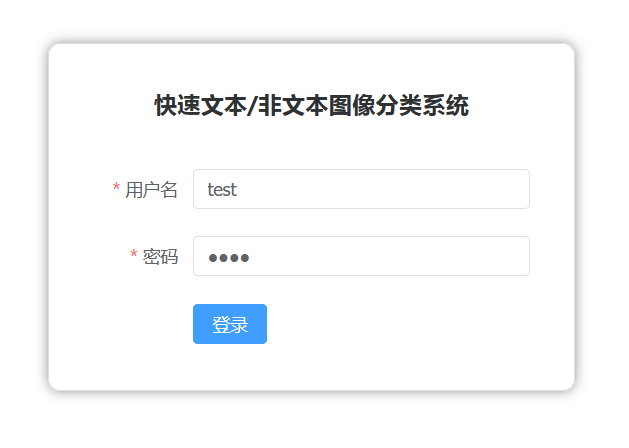
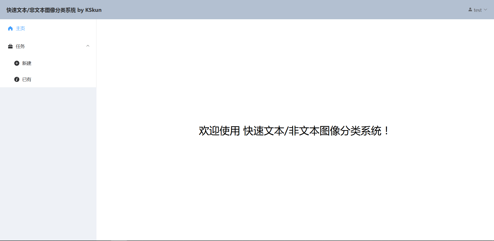
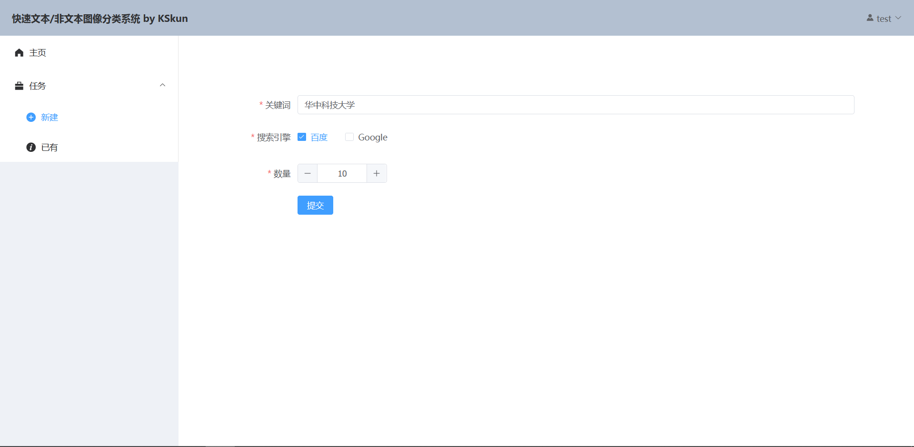
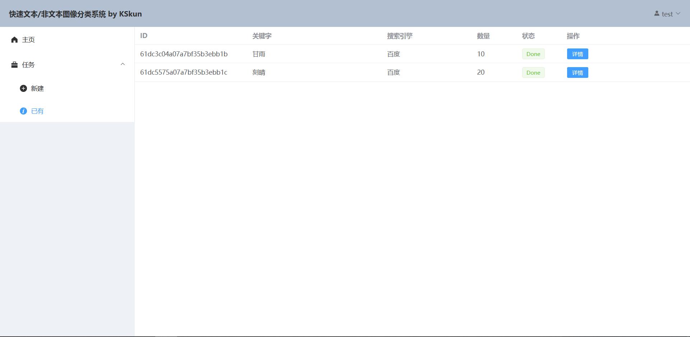
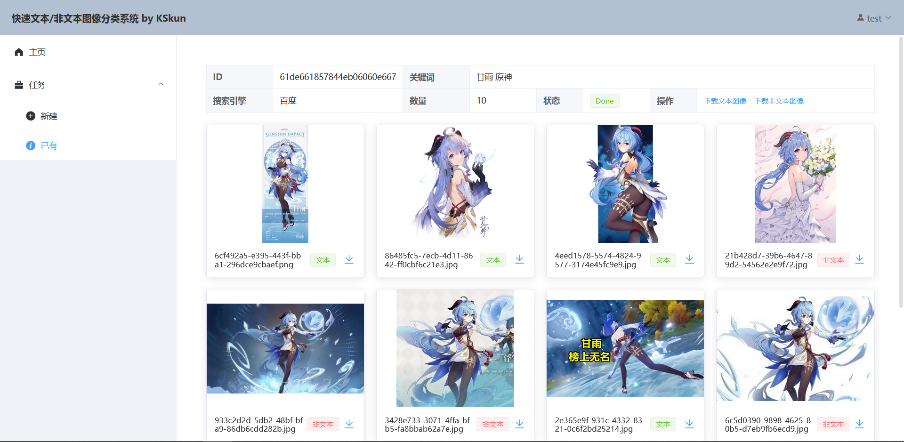

# Image-Classifier-Frontend

A frontend for text/non-text image crawler & classifier service. Part of software course project.

Root repo: https://github.com/KSkun/Image-Text-Nontext-Classifier-Service

## Features

The frontend is developed with [Vue 3](https://v3.cn.vuejs.org/)
and [Element Plus](https://element-plus.gitee.io/zh-CN/). It contains 2 pages and 4 sub-pages, use a frontend router
by [vue-router](https://router.vuejs.org/).

The frontend provides a simple and intuition interface for user to operate with the image classifier.

### Login Page

### Main Page

#### New Task Page

#### Task List Page

### Task Detail Page

## Configuration

### Local Startup

1. Run `npm install`.
2. Run `npm run serve`, a development server will be up.

### Build

1. Run `npm install`.
2. Run `npm run build`, and get the build at `dist` folder.
